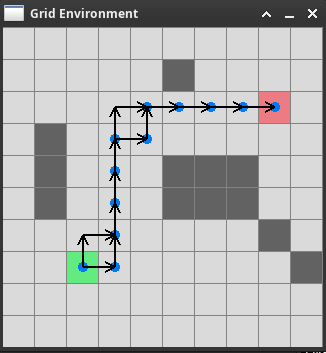

# Description

This is a project that implements the paper:

Konstantin Slutsky, Dmitry Yershov, Tichakorn Wongpiromsarn, Emilio Frazzoli. HIERARCHICAL MULTIOBJECTIVE SHORTEST PATH PROBLEMS.

In short, in multiobjective environment where the cost of traversal from state to state is represented by a set of cost monoids called the multicost. Each monoid of the multicost have different binary operations to compute its cost. In such an environment, classic Dijkstra algorithm sometimes fail to find an optimal solution. The solution proposed by the above paper is Iterative Dijkstra Propagation algorithm, which runs Dijkstra on each of the monoids to build an optimal subgraph based on optimal cost.

# Run

Either download the executable in Release or build it with the instructions below. Note that you will require Raylib.

# Build

Requires Raylib library


```bash

mkdir build
cd build
cmake ..
make
./multicost_planning

```



